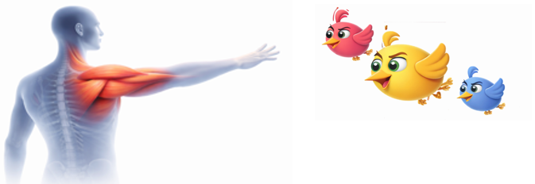
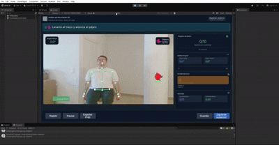

# RehabBirds
RehabBirds is a gamified rehabilitation application for shoulder abduction therapy. It uses real-time skeletal tracking (Nuitrack with an Intel RealSense D415 depth camera) to measure abduction angle, movement velocity, and postural compensations, enabling movement supervision and progress assessment during sessions.


<p align="center">
  
</p>

<h1 align="center">RehabBirds</h1>
<p align="center">
Gamified AR/MR rehabilitation for shoulder abduction therapy using real-time skeletal tracking.
</p>

<p align="center">
  <a href="#-demo">Demo</a> •
  <a href="#-features">Features</a> •
  <a href="#-hardware--software">Hardware/Software</a> •
  <a href="#-setup">Setup</a> •
  <a href="#-project-structure">Project Structure</a> •
  <a href="#-roadmap">Roadmap</a>
</p>

---

## 🆕 What’s New
- **v0.1** Prototype: shoulder abduction exercise + feedback + session metrics

---

## 🎥 Demo
[](https://www.youtube.com/watch?v=TU_VIDEO)

> Replace `TU_VIDEO` with your YouTube/Vimeo link.

---

## ✨ Features
- Real-time skeletal tracking with **Nuitrack**
- Depth camera: **Intel RealSense D415**
- Measures **abduction angle**, **velocity**, and **postural compensations**
- Session logging for progress tracking

---

## 🧰 Hardware & Software
- Unity: `2022.x/2023.x`
- Tracking: Nuitrack SDK
- Camera: Intel RealSense D415
- OS: Windows (recommended)

---

## ⚙️ Setup
1. Clone the repo
2. Open `UnityProject/` in Unity Hub
3. Install/Configure Nuitrack + RealSense (drivers + runtime)
4. Open the main scene: `Assets/Scenes/Main.unity`

---

## 📁 Project Structure
```txt
UnityProject/        # Unity project (Assets, Packages, ProjectSettings)
media/               # Images/GIFs used in README
docs/                # Documentation (optional)
