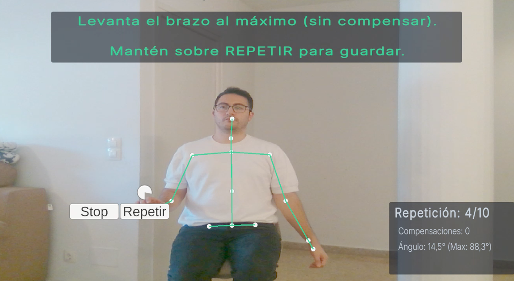
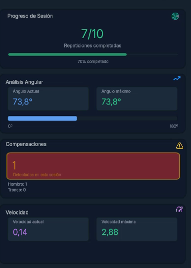
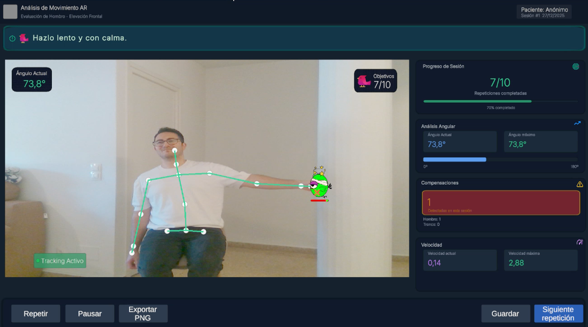

  

<h1 align="center">RehabBirds</h1>

Gamified AR/MR rehabilitation application for shoulder abduction therapy using real-time skeletal tracking.

  <a href="#-demo">Demo</a> •
  <a href="#-features">Features</a> •
  <a href="#-hardware--software">Hardware & Software</a> •
  <a href="#-setup">Setup</a> •
  <a href="#-screenshots">Screenshots</a> •
  <a href="#-roadmap">Roadmap</a>

---

## 🆕 What’s New
- **v0.1** – Prototype with shoulder abduction exercise, real-time feedback, and session metrics

---

## 🎥 Demo

---

## ✨ Features
- Real-time skeletal tracking using **Nuitrack**
- Depth sensing with **Intel RealSense D415**
- Measurement of **shoulder abduction angle**, **movement velocity**, and **postural compensations**
- Session logging for movement supervision and progress assessment
- Gamified visual feedback to improve patient engagement

---

## 🧰 Hardware & Software
- **Unity**: 2022.x / 2023.x
- **Tracking SDK**: Nuitrack
- **Depth Camera**: Intel RealSense D415
- **Operating System**: Windows (recommended)

---

## ⚙️ Setup
1. Clone the repository
2. Open the `UnityProject/` folder in Unity Hub
3. Install and configure **Nuitrack** and **Intel RealSense** drivers and runtime
4. Open the main scene: `Assets/Scenes/Main.unity`
5. Run the project and perform user calibration

---

## 🖼 Screenshots

  
  
  

---

## 🗺 Roadmap
- [ ] Additional rehabilitation exercises
- [ ] Therapist mode with configurable presets and reports
- [ ] Improved detection of postural compensations
- [ ] Export of session data (CSV / JSON)
- [ ] Clinical validation with multiple users

---

## 📜 License
Specify your license here (e.g., MIT, Academic, etc.)
